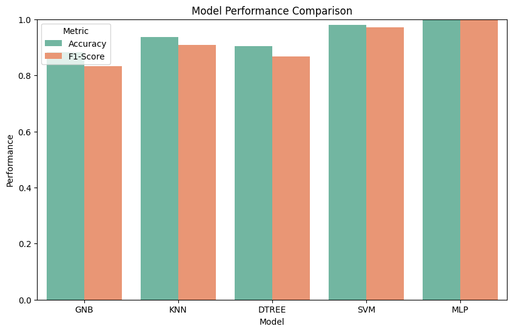

# Analysis of Wisconsin Breast Cancer Dataset

This project was developed as part of the Intelligent Systems course for my Bioinformatics degree. It encompasses a complete study of the Wisconsin Breast Cancer Dataset using scikit-learn, with a focus on feature analysis, data preprocessing, and predictive modeling.

## Project Description

The analysis presented here involves a deep dive into the Wisconsin Breast Cancer Dataset, aiming to apply machine learning to assist in the prediction and understanding of breast cancer characteristics. Through the application of preprocessing techniques such as Principal Component Analysis (PCA) and data normalization, and the implementation of various machine learning models, we've laid out a comprehensive exploratory and predictive framework.

## Techniques Used

- **Data Preprocessing**: Application of PCA for dimensionality reduction and normalization for feature scaling.
- **Machine Learning Models**: Training and evaluation of the following models:
  - Naive Bayes
  - Decision Trees
  - K-Nearest Neighbors (KNN)
  - Support Vector Machines (SVM)
  - Multi-Layer Perceptrons (MLP)

## Results

Upon completion of the study, it was found that Support Vector Machines (SVM) and Multi-Layer Perceptrons (MLP) exhibited superior performance in the classification tasks. Visual results and performance metrics for these models are provided to demonstrate their predictive capabilities within this domain.

## Conclusion

This repository serves as a record of the academic exercise undertaken to apply practical machine learning techniques to a real-world dataset, as part of curriculum requirements for my degree in Bioinformatics.

---
